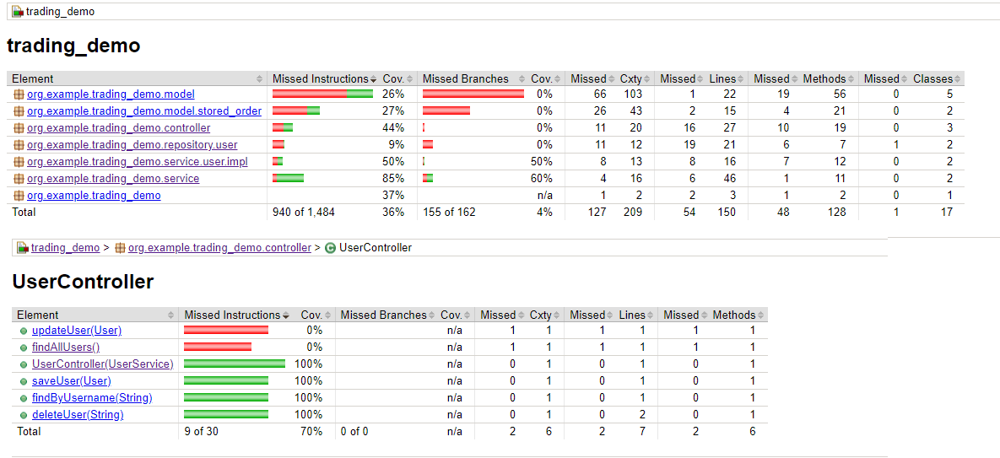
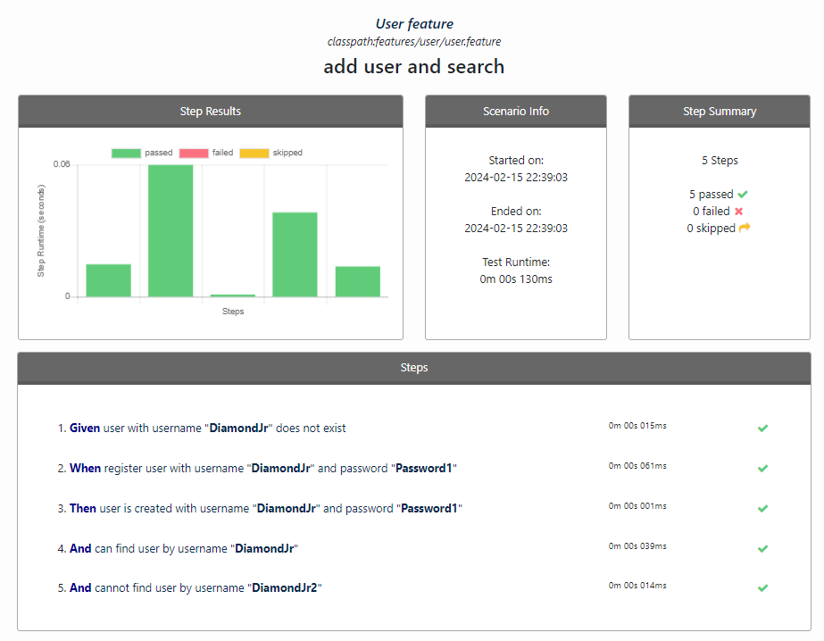
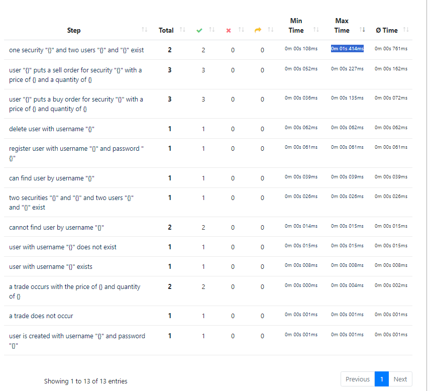
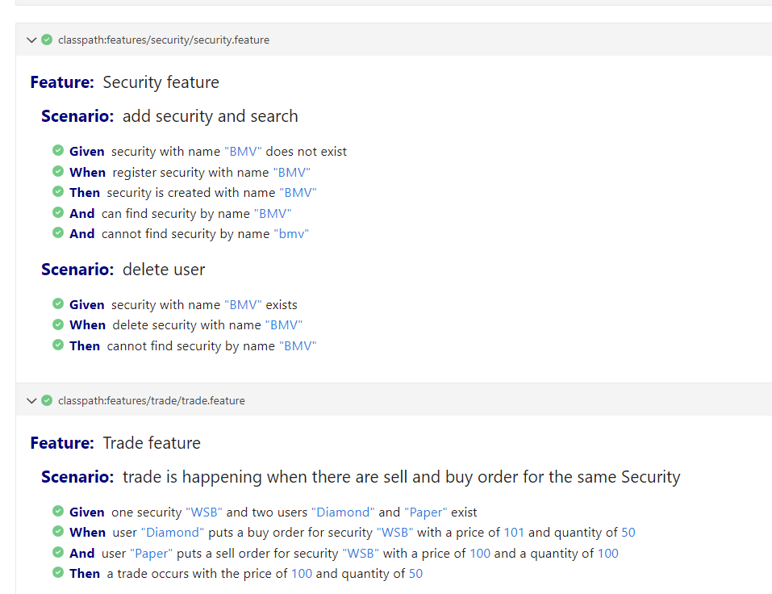

# RestAPI by Spring Boot

* Model: User, Security, Order, Trade
* H2 memory DB. Console at <http://localhost:8080/h2-ui>
* Cucumber BDD test

## Run BDD test

`mvn test`

### Test reports

Run `mvn verify`

Observe HTML reports in

* `target/site/jacoco/index.html` Jacoco coverage report



* `target/generated-report/index.html` Cluecumber report




* [trivago/cluecumber](https://github.com/trivago/cluecumber/)

* `target/cucumber-report/cucumber.html`



## Manual requests

* post buy order and trade: POST: http://localhost:8080/api/v1/order/buy_and_trade

```json
{
  "price": 100,
  "quantity": 80,
  "securityName": "Apple",
  "userName": "user4"
}
```

* post sell order and trade: POST: http://localhost:8080/api/v1/order/sell_and_trade

```json
{
  "price": 150,
  "quantity": 40,
  "securityName": "Apple",
  "userName": "user3"
}
```
* list orders: GET: http://localhost:8080/api/v1/order

* list users: GET: http://localhost:8080/api/v1/users

* add user: POST: http://localhost:8080/api/v1/users/save

```json
{
    "username": "user5",
    "password": "pw5"
}
```

* list securities: GET: http://localhost:8080/api/v1/security
* find by name: GET: http://localhost:8080/api/v1/security/Apple
* add security: POST: http://localhost:8080/api/v1/security/save

```json
{
    "name": "sec-name"
}
```

* delete security: DELETE: http://localhost:8080/api/v1/security/delete/sec-name