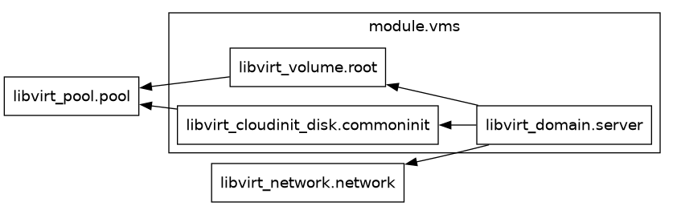

# Up debian on libvirt VM

## About the Cairo project

This Terraform configuration is designed to automate the creation and management of a virtual machine (VM) environment using the **libvirt** provider with QEMU on a Linux system. The goal is to create a fully functional virtual machine with custom networking, storage, and initialization settings, leveraging cloud-init for provisioning.

## v1

In [this document](docs/details_v1.md), there is a breakdown of the resources and their configuration.

```sh
# Initializes the Terraform working directory by downloading the required provider plugins.
terraform init
# Executes the Terraform plan, creating the resources defined in your configuration files.
terraform apply
# Launches the GUI for the VM, allowing you to interact with the VM. 
sudo virt-viewer cairo-vm1
```

## v2

In this version of the Terraform setup, the configuration for defining Libvirt VM domains has been moved into a separate module. The settings for this module are passed through a dedicated set of variables, allowing for more modular and reusable infrastructure code.

Template Provider replaced with `templatefile` function.

The module creates two virtual machines (VMs) with user-defined settings, such as the domain name, memory allocation, and CPU count.

For further details, please refer to [this document](docs/details_v2.md).



### Links

* [Libvirt Provider](https://registry.terraform.io/providers/dmacvicar/libvirt/latest/docs)
* [Template Provider](https://registry.terraform.io/providers/hashicorp/template/latest/docs)
* [templatefile function](https://developer.hashicorp.com/terraform/language/functions/templatefile).
* [Debian Official Cloud Images](https://cloud.debian.org/images/cloud/)
* [Cloud-init module: set-password](https://cloudinit.readthedocs.io/en/latest/reference/modules.html#set-passwords)
* [CloudInit Module: SSH](https://cloudinit.readthedocs.io/en/latest/reference/modules.html#ssh)
* [Cloud config examples: Including users and groups](https://cloudinit.readthedocs.io/en/latest/reference/examples.html#including-users-and-groups)

---
