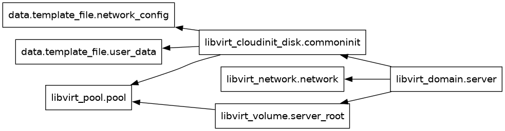

# Terraform Configuration for Libvirt QEMU Virtual Machine (v1)

This Terraform configuration creates a virtual machine environment using the **libvirt** provider with QEMU on a Linux system.



## Required Providers

```hcl
terraform {
    required_providers {
        libvirt = {
            source = "dmacvicar/libvirt"
            version = "0.8.0"
        }
    }
}
```

We are specifying the **libvirt** provider with version `0.8.0` from the `dmacvicar` repository, which allows Terraform to interact with QEMU virtual machines.

## Provider Configuration

```hcl
provider "libvirt" {
  uri = "qemu:///system"
}
```

This sets up the connection to the QEMU hypervisor, using the system-wide session (`qemu:///system`).

## Resources

### 1. Network Configuration

A virtual network is defined with NAT mode, providing internal IP addresses for the VM and enabling DNS resolution within the local network. This ensures the VM has a private network for communication while still having external access through network address translation. **DNS** is enabled for local network resolution with the domain `cairo.local`.

```hcl
resource "libvirt_network" "network" {
  name = "cairo"
  autostart = true
  mode = "nat"
  domain = "cairo.local"
  addresses = ["10.0.2.0/24"]

  dns {
    enabled = true
    local_only = true
  }
}
```

### 2. Storage Pool

A storage pool is created to manage disk volumes.

```hcl
resource "libvirt_pool" "pool" {
  name = "cairo"
  type = "dir"
  path = "/qemu/disk/cairo"
}
```

This creates a storage pool for the VM's disks in the directory `/qemu/disk/cairo`.

### 3. Disk Volume

A root volume is provisioned using a pre-downloaded Debian cloud image. This volume acts as the VM's main storage, preconfigured with a Debian operating system.

```hcl
resource "libvirt_volume" "server_root" {
  name = "server_root"
  pool = libvirt_pool.pool.name
  source = "https://cloud.debian.org/images/cloud/sid/daily/20241011-1897/debian-sid-generic-amd64-daily-20241011-1897.qcow2"
  format = "qcow2"
}
```

The latest Debian SID cloud image (`qcow2` format) is downloaded and stored in the pool.

### 4. Cloud Init Configuration

Cloud-init is used to configure the VM during its first boot. A custom template for user data and network settings is provided to automate the initial configuration of the operating system, including things like hostname, users, and network settings.

```hcl
resource "libvirt_cloudinit_disk" "commoninit" {
  name = "server_cloudinit"
  pool = libvirt_pool.pool.name
  user_data = data.template_file.user_data.rendered
  network_config = data.template_file.network_config.rendered
}
```

Cloud-init is used to provide initialization scripts to the VM:
- **User Data**: Custom user configuration (`cloud_init.cfg`).
- **Network Configuration**: Custom network settings (`network_config.cfg`).

### 5. Virtual Machine Configuration

The VM is defined with specific CPU and memory resources, attached to the previously defined network and disk. Console and graphical interfaces are also configured, allowing access through serial ports and the SPICE protocol for graphical management.

```hcl
resource "libvirt_domain" "server" {
  name = "cairo-vm1"
  memory = "1024"
  vcpu = 1
  cloudinit = libvirt_cloudinit_disk.commoninit.id
  
  network_interface {
    network_name = libvirt_network.network.name
  }

  disk {
    volume_id = libvirt_volume.server_root.id
  }

  console {
    type = "pty"
    target_port = "0"
    target_type = "serial"
  }

  console {
    type = "pty"
    target_type = "virtio"
    target_port = "1"
  }

  graphics {
    type = "spice"
    listen_type = "address"
    autoport = true
  }
}
```

- **Name**: `cairo-vm1`
- **Memory**: 1024 MB
- **vCPU**: 1
- **Cloud-init**: Configured with the custom `cloud_init.cfg` and network settings.
- **Network Interface**: Connected to the `cairo` NAT network.
- **Disk**: Uses the previously downloaded Debian image.
- **Console and Graphics**: Serial and Spice graphical console are configured.

## Template Files

Two template files are used for cloud-init and network configuration:

- **`cloud_init.cfg`**: This file contains user-specific configuration details, such as the hostname and root user password. When the VM is provisioned, this file is used to configure the basic settings of the operating system. The root password is set, and SSH password authentication is enabled for easy access to the VM (`ssh_pwauth: true`).

- **`network_config.cfg`**: This file contains the network settings for the VM, defining how the network interface should be configured. These settings are used by cloud-init to automatically generate the appropriate network configuration file on the VM. The resulting network settings will be written to `/etc/netplan/50-cloud-init.yaml` on the server, ensuring that the VM's network is set up correctly upon first boot.

These configurations are applied during the first boot of the VM, ensuring that both the user and network are properly initialized.

## Conclusion

This Terraform code sets up a complete libvirt environment with custom networking and storage, using cloud-init to provision a Debian-based virtual machine. The configuration is flexible and allows for easy modifications of VM parameters such as memory, CPU, and network settings.

---

[index](../README.md)
