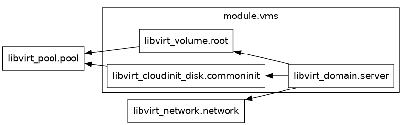

# Terraform Configuration for Libvirt QEMU Virtual Machine (v2)

In the second version of this Terraform configuration, the definition of the Libvirt VM domain is moved into a separate module (`vmdomain/main.tf`), with its settings configured through a block of variables (`vmdomain/variables.tf`).

## Cloud-Init Configuration

Using Cloud-init, users are configured with SSH key-based authentication, and password-based authentication is disabled.

- **`preserve_hostname`** is set to `false`, ensuring the VM hostname is updated based on the Terraform variables.
- **`prefer_fqdn_over_hostname`** is set to `true`, meaning the fully qualified domain name (FQDN) will be prioritized over the hostname.

#### Network Configuration

The network is configured with DHCP disabled, and the IP addresses are set statically through Terraform variables.

In this network configuration:

- **DHCP is disabled** for both IPv4 and IPv6 (`dhcp4: false`, `dhcp6: false`).
- The **IP addresses** are set statically using the `network_address` and `network_bits` variables from Terraform.
- **Gateway** and **nameservers** are configured with the gateway address being set as `${network_gateway}`, ensuring proper routing and DNS configuration.

---

[index](../README.md)
